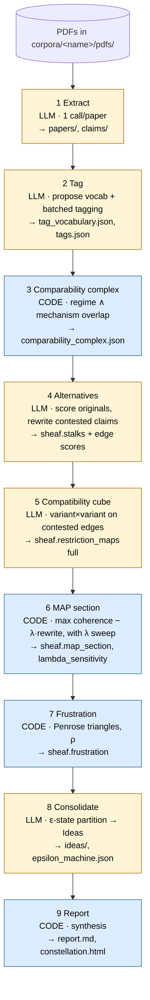
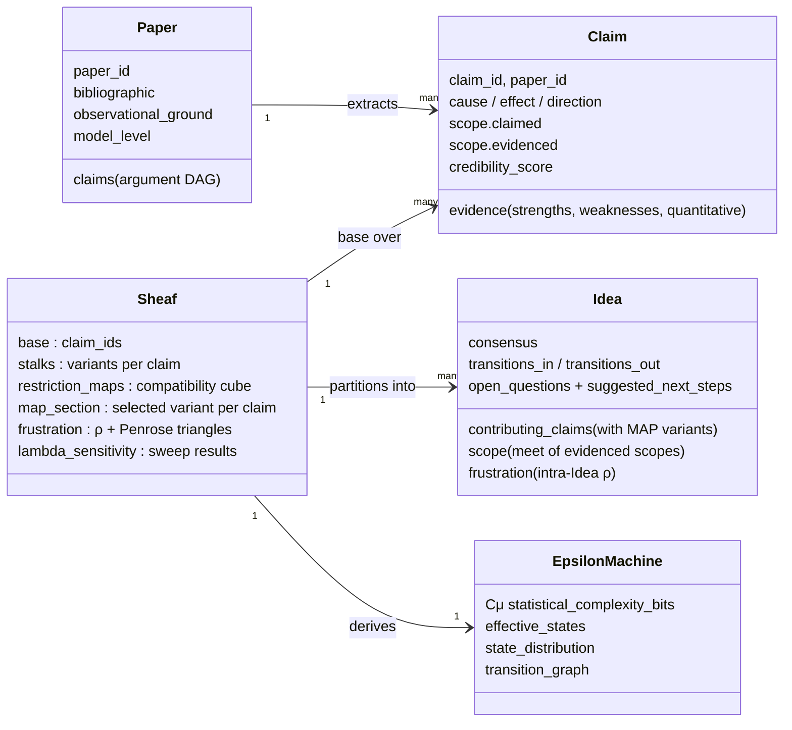
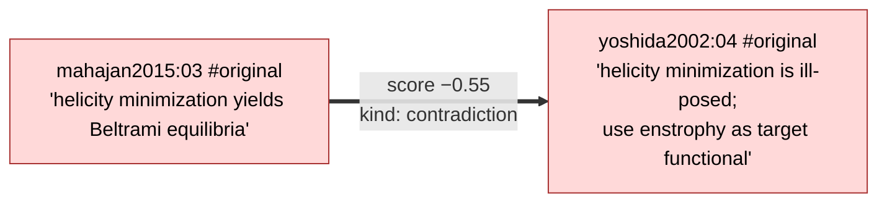
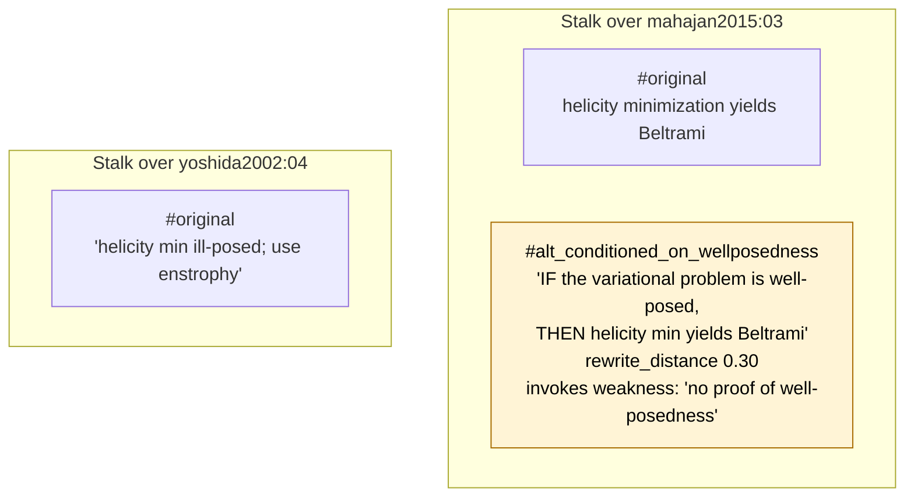
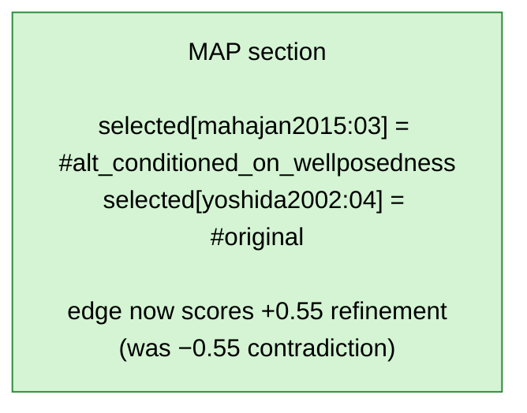
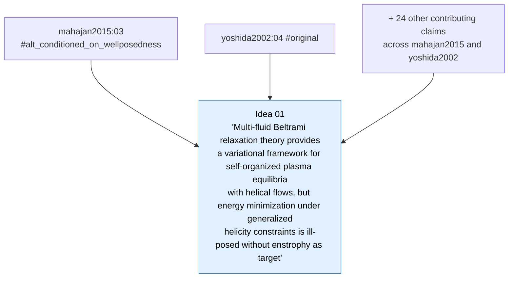
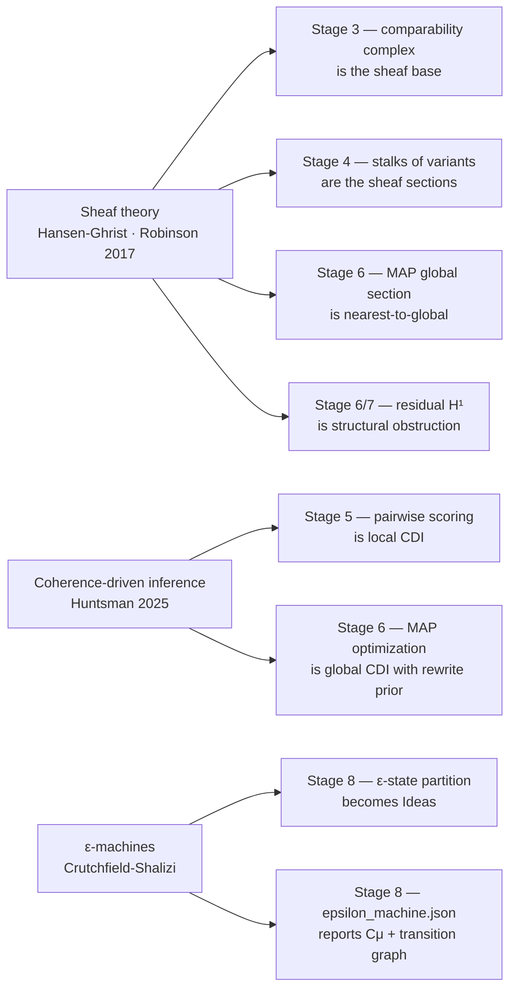

# Constellation — architecture diagrams

Each block is a Mermaid diagram. Render natively on GitHub/GitLab, paste into
Notion or Confluence, or open in https://mermaid.live to tweak.

---

## 1. Pipeline at a glance

Nine stages, run sequentially over a corpus. Stages that call the LLM are
gold; pure-code stages are blue. Each stage reads upstream artifacts from disk
and writes its own — any stage can be re-run in isolation with `--from N --to N`.



---

## 2. What a run produces

JSON-on-disk is the source of truth at MVP. Every artifact is independently
inspectable.

```text
runs/<corpus>_<utc>/
├── run_config.json          ← model, schemas, prompt hashes, stage params
├── papers/<paper_id>.json   ← stage 1
├── claims/<paper_id>_NN.json← stage 1, with argument DAG
├── tag_vocabulary.json      ← stage 2a (semilattice + SNAG vocabulary)
├── tags.json                ← stage 2b (per-claim coordinates)
├── comparability_complex.json  ← stage 3 (the sheaf's base)
├── sheaf.json               ← stages 4–7: stalks, restriction maps,
│                                MAP section, λ sensitivity, frustration
├── ideas/<idea_id>.json     ← stage 8 (one ε-state per file)
├── epsilon_machine.json     ← stage 8 (Cμ + transition graph)
├── report.md                ← stage 9 (human-readable synthesis)
├── constellation.html       ← stage 9 (interactive D3 view)
├── failures.json            ← structured per-stage failures, when present
└── llm_cache/<stage>/<hash>.json  ← successful validated LLM responses
```

---

## 3. Object model

Four core object types plus the corpus-level ε-machine artifact.



---

## 4. The core mechanic — worked example

The v2 innovation: claims aren't clustered first. Instead, each claim sits in
a *stalk* of evidence-faithful rewrites. A global MAP optimization picks one
variant per claim that maximizes pairwise compatibility minus rewrite cost.
Then surviving claims are partitioned into Ideas.

This worked example uses real claims from the small_atlas run.

### Step 1 — stage 4a: score original-original on every comparability edge



### Step 2 — stage 4c: generate evidence-faithful rewrites for each contested claim



### Step 3 — stage 6: MAP picks one variant per claim, globally

Maximize Σ score(selected_pair) − λ × Σ rewrite_distance over all claims.



### Step 4 — stage 8: partition MAP-selected claims into ε-states (Ideas)



---

## 5. Theoretical grounding

Three sources, each load-bearing in v2 (vs. v1 where they were inspirational).



---

## A few framing claims for the talk

- **The architectural shift** is replacing v1's cluster-first-then-check-coherence
  with sheaf-over-comparability-complex. Clustering is gone; coherence is global.
- **The hypothesis-space stalk** is the v2 unit of vote: MAP votes over *variants*
  of claims, with rewrite distance as the prior preventing free-for-all rewriting.
- **Residual H¹ is informative.** Edges where no rewrite within evidence-faithful
  distance resolves the contradiction are real obstructions in the literature,
  not failures of the pipeline.
- **The deliverable is Ideas + ε-transitions + open questions.** Each open
  question carries typed `suggested_next_steps` (experiment, simulation,
  theoretical, …) so a researcher can filter "what to work on next."
- **MVP scale** is 10–20 papers. Output is 3–10 Ideas. We've validated the full
  pipeline end-to-end on small_atlas (8 papers → 6–8 Ideas, Cμ ~2.5 bits, ρ &lt; 0.05).
